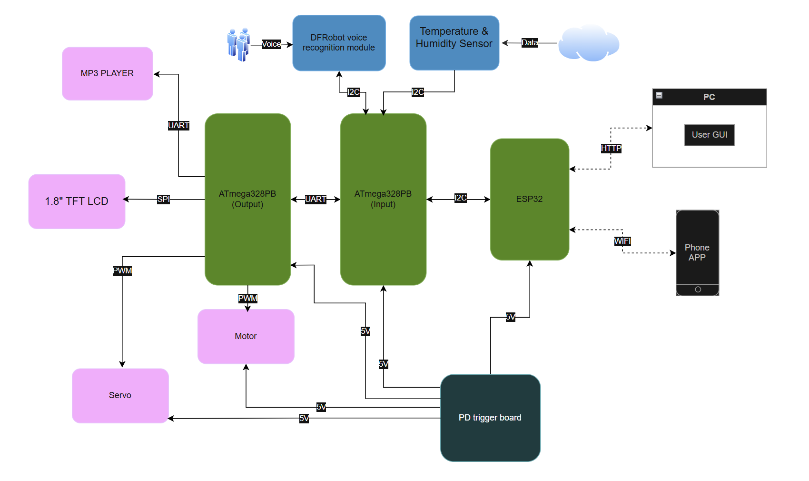
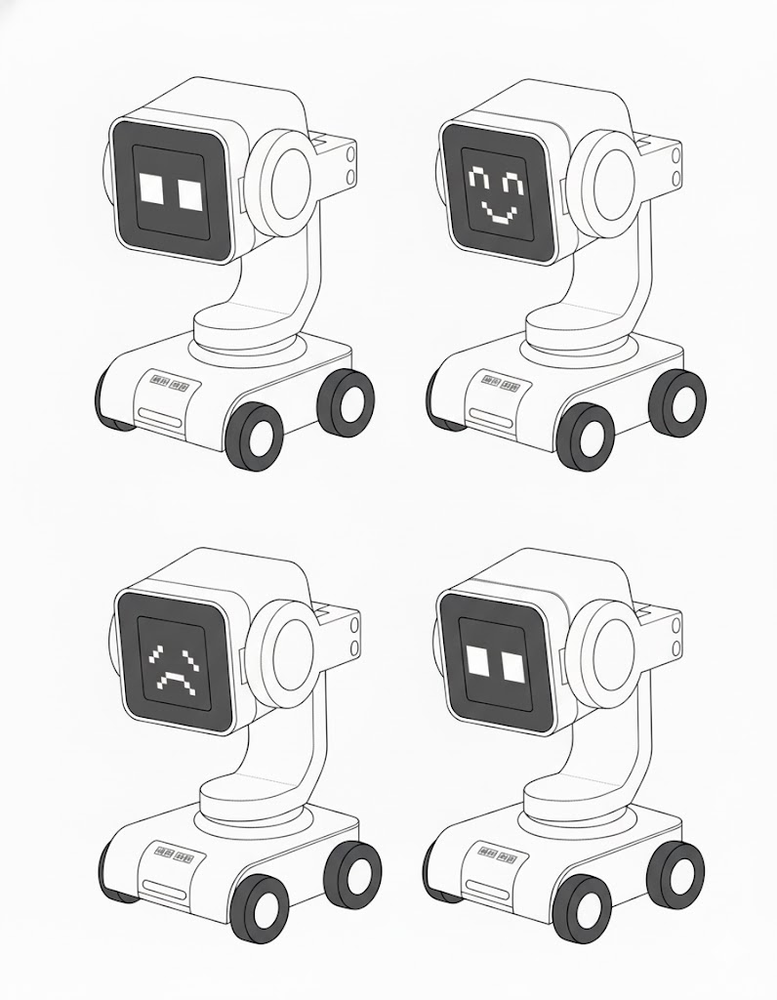
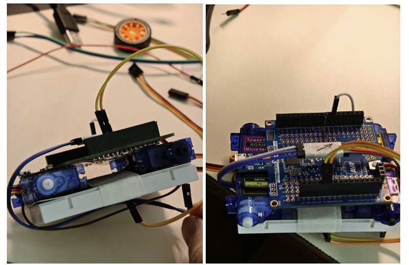
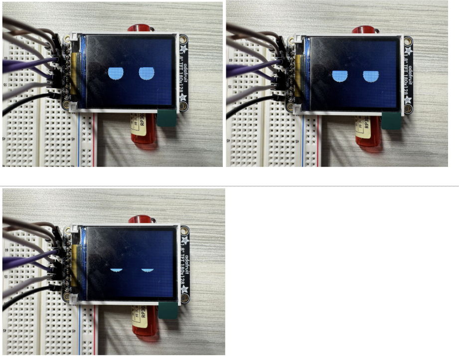

# final-project-skeleton

**Team Number: Team25**

**Team Name: GANHEMT**

| Team Member Name      | Email Address                     |
| --------------------- | --------------------------------- |
| **Tanxuan Li**  | **jeffli88@seas.upenn.edu** |
| **Xiao Wang**   | **wang96@seas.upenn.edu**   |
| **Zhenyao Liu** | **liu59@seas.upenn.edu**    |

**GitHub Repository URL: [GaN HEMT](https://github.com/upenn-embedded/final-project-f25-f25-final_project_t25.git)**

**GitHub Pages Website URL:** [GaN HEMT](https://upenn-embedded.github.io/final-project-f25-f25-final_project_t25)

## Final Project Proposal

### 1. Abstract

Our project aims to design and implement an interactive desktop pet robot that can engage in real-time communication with users through voice, visual, and motion responses. The system is built on an ATmega328PB microcontroller, integrating an offline voice recognition module, a temperature and humidity sensor, a TFT LCD display, a DFR0299 voice playback module, micro servos, and a Wi-Fi module.

The robot can recognize voice commands, respond with synthesized or pre-recorded speech, and display dynamic facial expressions and environmental information such as temperature and humidity on the LCD. Additionally, the Wi-Fi module allows users to control the robot through a mobile application, providing an alternative way to interact and customize behaviors.

### 2. Motivation

In modern life, people increasingly spend long hours studying or working alone at their desks, often leading to stress and a lack of social interaction. Our project aims to design a smart desktop companion that provides emotional engagement and environmental awareness through human–machine interaction. By combining voice recognition, facial expression display, and motion response, the robot creates a friendly and interactive experience that brings liveliness to a personal workspace.

### 3. System Block Diagram

System Block Diagram:

**High-level design (per figure):** a two-MCU architecture separates *sensing/comms* from  *actuation/UI* . The **Input MCU (ATmega328PB)** aggregates sensors and bridges to Wi-Fi; the **Output MCU (ATmega328PB)** drives motors, servos, display, and audio. An **ESP32** provides Wi-Fi/HTTP links to a **PC GUI** and  **phone app** . Power comes from a  USB-C PD power bank/brick via a PD trigger board.

#### Critical Components & Roles

* **ATmega328PB (Input)**
  * Collects **DFRobot offline voice** (I²C) and **Temp/Humidity sensor** (I²C).
  * Exchanges commands/status with ESP32 (I²C).
  * Sends parsed commands to Output MCU ( **UART** ).
* **ATmega328PB (Output)**
  * Drives **1.8″ TFT LCD** ( **SPI** ) for eyes/status.
  * Controls **motors** ( **PWM** ) and **servos** ( **PWM** ).
  * Plays feedback audio via **DFPlayer MP3** ( **UART** ).
* **ESP32**
  * **Wi-Fi** + **HTTP** to PC GUI / phone app.
  * Local bridge between network and Input MCU (I²C).
* **DFRobot Voice Recognition Module**
  * Local, offline command recognition (I²C input → events to Input MCU).
* **Temp & Humidity Sensor**
  * Environmental telemetry (I²C to Input MCU).
* **DFPlayer Mini + Speaker**
  * Audio prompts and reactions (UART from Output MCU).
* **Actuators**
  * **4× Step motors** (Sequence signal from Output MCU via motor drivers).
  * **2× micro servos** (50 Hz Pulse from Output MCU).

#### Communication Map

* **I²C**
  * Input MCU ↔ Voice module
  * Input MCU ↔ Temp/Humidity sensor
  * Input MCU ↔ ESP32 (command/status bridge)
* **UART**
  * Input MCU ↔ Output MCU (bidirectional command channel)
  * Output MCU → DFPlayer Mini (audio control)
* **SPI**
  * Output MCU → 1.8″ TFT LCD
* **PWM**
  * Output MCU → 2× Motor driver PWM inputs. 4 singals per side, drive the step motor in equentially sending the 4 signals.
  * Output MCU → 2× Servo signal lines. 50 Hz pulse. 
* **Wi-Fi / HTTP**
  * ESP32 ↔ PC GUI / Phone App (remote panel, telemetry)

#### Power Regulation

* **Source:** USB-C Power Delivery (PD) power bank; PD Trigger Board, negotiates a fixed PD voltage (5v) and exposes it as a stable DC output.
* **Decoupling:** ≥470–1000 µF on motor rail; ≥100 µF near ESP32; 0.1 µF at each IC.
* **Grounding:** common ground star-point; keep ESP32 antenna and mic away from motor wiring.

#### Data/Control Flow

1. User speaks → Voice module (I²C) → Input MCU parses → sends CMD via UART to Output MCU.
2. Remote panel (PC/phone) → HTTP over Wi-Fi → ESP32 → I²C to Input MCU → UART to Output MCU.
3. Output MCU executes: PWM motors/servos, updates TFT (SPI), triggers DFPlayer (UART).
4. Status/telemetry (sensor values, heartbeats) flow back to ESP32 → HTTP → PC/phone UI.

### 4. Design Sketches

* **Overall Appearance:**

  The system is designed as a  **desktop companion robot (“desk pet”)** . It reacts to human voice and remote commands, displaying animated “eye” expressions on its TFT screen and responding through motion and sound.
* **Functional Layout (see figure above):**

  * **ATmega328PB (Input MCU)** collects data from the **voice recognition sensor** and  **temperature/humidity sensor** , then communicates with the **ESP32** via I²C.
  * **ESP32** handles Wi-Fi communication with the **PC User GUI** and **Phone App** via HTTP/Wi-Fi.
  * **ATmega328PB (Output MCU)** drives the  **TFT display** ,  **DFPlayer MP3 module** ,  **motors** , and **servos** using SPI, UART, and PWM interfaces.
  * **Power** is provided by a USB-C PD source through a PD trigger board that outputs a fixed DC 5V voltage.
* **Critical Design Features:**

  * Compact and **cute robotic form** that expresses emotions through the screen and sound.
  * **Offline speech recognition** for direct command response without internet.
  * **Wi-Fi remote control** via PC and phone dashboard for movement and reaction commands.
  * Integrated  **multimodal feedback** : voice, motion, and display.
* **Manufacturing & Assembly:**

  * **3D printing** will be used to create the outer shell and mounting brackets.
  * The structure will be assembled on an **acrylic baseplate** for stability.
  * **No advanced machining** required—hand tools and a 3D printer are sufficient.

Sketch for this project:

### 5. Software Requirements Specification (SRS)

**5.1 Definitions, Abbreviations**

* **MCU**: ATmega328PB microcontroller
* **DFR0299**: MP3 module, controlled via UART serial commands
* **LCD (ST7735)**: 1.8" 128×160 SPI TFT color display controller, SPI protocol
* **AHT20**: Adafruit AHT20 Temperature & Humidity Sensor, I²C interface
* **Micro Servo**: TowerPro SG92R, PWM control
* **ASR**: Automatic Speech Recognition
* **NDJSON**: Newline-Delimited JSON stream protocol for HTTP communication
* **CMD**: Control Command (MOVE, STOP, TURN, SERVO, etc.)
* **UI**: Remote control user interface (PC web or mobile web/app)

**5.2 Functionality**

| ID     | Description                                                                                                                                                                                                                                                                                   |
| ------ | --------------------------------------------------------------------------------------------------------------------------------------------------------------------------------------------------------------------------------------------------------------------------------------------- |
| SRS-01 | The AHT20 temperature reading shall retain 1 °C resolution, and the humidity display shall retain 1 % RH resolution.                                                                                                                                                                         |
| SRS-02 | LCD partial area refresh shall complete within ≤ 50 ms.                                                                                                                                                                                                                                      |
| SRS-03 | After a normal playback trigger, the DFR0299 shall transmit a complete command frame to the MCU and receive acknowledgement (or busy signal) within ≤ 500 ms.                                                                                                                                |
| SRS-04 | Micro Servo actived by 50Hz pulse, then read the duty cycle and respond to the a certain angle basic on the duty cycle value.                                                                                                                                                                 |
| SRS-05 | The offline speech recognition module shall recognize at least 10 predefined voice commands (e.g., forward, back, left, right, stop, hello) with an accuracy ≥ 85 % under indoor noise ≤ 65 dB. The end-to-end latency (from end of speech to command reception by MCU) shall be ≤ 600 ms. |
| SRS-06 | Communication between MCU and PC (via ESP32/HTTP bridge) shall implement a sequence-acknowledgment mechanism.                                                                                                                                                                                 |
| SRS-07 | The remote control panel (desktop & mobile) shall provide MOVE/STOP/TURN/SERVO/EMOTE/SAY controls. The visible feedback latency (UI action → MCU acknowledgment) shall be ≤ 200 ms (95th percentile).                                                                                       |

### 6. Hardware Requirements Specification (HRS)

**6.1 Definitions, Abbreviations**

* **VCC / 5 V / 3V3**: Power rails
* **MCU**: ATmega328PB microcontroller
* **DFR0299**: MP3 module, controlled via UART serial commands
* **LCD (ST7735)**: 1.8" 128×160 SPI TFT color display controller, SPI protocol
* **AHT20**: Adafruit AHT20 Temperature & Humidity Sensor, I²C interface
* **Micro Servo**: TowerPro SG92R, PWM control
* 3D **printing**: To print the case and connections
* **ASR**: Automatic Speech Recognition

**6.2 Functionality**

| ID     | Description                                                                                                                                                                                                                         |
| ------ | ----------------------------------------------------------------------------------------------------------------------------------------------------------------------------------------------------------------------------------- |
| HRS-01 | The AHT20 shall be powered by 3.3 V, with power ripple ≤ 50 mV pp. The physical connection length should be ≤ 20 cm and routed away from high dv/dt signals.                                                                      |
| HRS-02 | The LCD shall display temperature and humidity readings, five facial expressions, and text responses to voice commands.                                                                                                             |
| HRS-03 | Upon a normal speech trigger, the DFR0299 shall produce the first audible syllable within ≤ 1.5 s, and shall be capable of playing ten distinct response phrases.                                                                  |
| HRS-04 | The micro servo requires a continuous 50 Hz PWM signal (corresponding to a 20 ms period). Within each cycle, the servo angle is precisely determined by the width of the high-level pulse, typically ranging from 1 ms to 2 ms. |
| HRS-05 | The motor controlled by the PWM signal that on and off the MOSFET.                                                                                                                                                                  |
| HRS-06 | Module–MCU link (I²C 400 kHz or UART 115200) shall run 10 min error-free (CRC/frame = 0).                                                                                                                                         |
| HRS-07 | The power supply should be able to support MCU and peripheral. Max current>=2A.                                                                                                                                                     |

### 7. Bill of Materials (BOM)

[ESE5190 F25 Final Project BOM.xlsx - Google Sheets](https://docs.google.com/spreadsheets/d/14g6MY4t1TwcqjPcMjSIWHGLUo1T9UqBL/edit?gid=2090728227#gid=2090728227)

**Core Components**

* **ATmega328PB Xplained Mini ×2** – Main MCUs; one handles inputs (sensors, voice, Wi-Fi), the other handles outputs (motors, servos, display).
* **FeatherS2 (ESP32-S2)** – Wi-Fi bridge for HTTP communication with PC/mobile app.

**Input & Communication**

* **Gravity: Offline Voice Recognition Sensor (DFRobot)** – Local speech command recognition (I²C).
* **Temperature & Humidity Sensor (e.g., BME280/SHT31)** – Environment telemetry for UI display.

**Output & Feedback**

* **1.8” 128×160 TFT LCD (ST7735)** – Display robot “eye” and status (SPI).
* **DFPlayer Mini MP3 Module + 3 W Speaker** – Audio output for responses and sound effects.

**Actuation**

* **Micro Servo (TowerPro SG92R) ×2** – Control eye/head movement (via PCA9685).
* **DC Gear Motor ×4 (TT/N20 type)** – Drive 4 wheels for motion control.
* **TB6612FNG Motor Driver ×2** – Dual-channel drivers, one per motor pair.
* **PCA9685 16-ch PWM Module** – I²C PWM expander for servos/LEDs.
* **65 mm Multi-Hub Wheels ×4** – Wheels for TT/N20 motors.

**Power & Regulation**

* **USB-C PD Power Bank** – Primary source (≥20 W).
* **USB-C PD Trigger Board** – Negotiates and outputs fixed 5 V.
* **Bulk Capacitors (470–1000 µF)** – Filter motor surges and Wi-Fi peaks.
* **Level Shifter (BSS138)** – I²C 5 V↔3.3 V conversion if needed.
* **Emergency Stop Button** – Safety cutoff for PWM outputs.

### 8. Final Demo Goals

* **Demonstration Setup**

  * The robot will be placed on a tabletop or smooth indoor floor.
  * Powered by a USB-C PD source via a PD trigger board.
  * Controlled through a **PC web dashboard** and **mobile app interface** over Wi-Fi.
* **Core Demonstrations**

  * **Speech Interaction:**
    * Say voice commands such as *“forward,” “stop,” “turn left,”* or *“hello”* to trigger immediate robot actions.
    * Display visual feedback (eye animation on TFT screen) and audio confirmation via DFPlayer.
  * **Wi-Fi Communication:**
    * ESP32 bridges commands between the robot and PC/mobile remote panel.
    * Real-time control and status feedback demonstrated through a browser UI.
  * **Remote Control Panel:**
    * Web interface buttons to control motion, servos, and expressions.
    * Command latency and heartbeat reliability shown live (RTT ≤ 80 ms).
* **Physical Constraints**

  * Indoor space (≈ 2 m × 2 m) required for safe movement.
  * Flat surface; lightweight chassis; wired USB debugging available.
  * No external network required—ESP32 operates as local access point or on lab Wi-Fi.
* **Evaluation Metrics**

  * Successful local and online speech recognition (≥ 85 % accuracy).
  * Stable motion control via remote panel (no packet loss > 1 %).
  * Consistent power operation—no brownouts during Wi-Fi transmission.

### 9. Sprint Planning

| Milestone  | Functionality Achieved                                                       | Distribution of Work                                                                                                                                                                                                 |
| ---------- | ---------------------------------------------------------------------------- | -------------------------------------------------------------------------------------------------------------------------------------------------------------------------------------------------------------------- |
| Sprint #1  | Voice Recognition, Speaker, Sensor Reading                                   | It can perform speech recognition, perceive the surrounding environment in multiple aspects, carry out accurate measurements, and enable the speaker to play preset sounds.                                          |
| Sprint #2  | LCD and fixed the bugs last week. First draft of the 3D case. WIFI           | The screen can display the corresponding preset expressions, estimated at around 5 to 10 types. Make a prototype of the case based on the components. Able to communicate with the computer through the Wi-Fi module |
| MVP Demo   | Able to move forward and backwards, nod and shake. Second draft of the case. | Can move based on the input instructions.                                                                                                                                                                            |
| Final Demo | Assemble and print the 3D case                                               | Assemble everything.                                                                                                                                                                                                 |

## Sprint Review #1

### Plan for This Week

1. **ESP32 Wireless Communication:**

   Establish wireless communication between the ESP32 module and the PC through Wi-Fi using HTTP requests. The ESP32 was expected to retrieve information such as current time and weather data from a local server running on the PC, while the PC could monitor the controller’s state.
2. **LCD Display Exploration:**

   Gain a basic understanding of how the ST7735 LCD works on the ATmega328PB. Learn to draw basic shapes, test simple display functions, and implement an initial “facial expression” demo using primitive graphics.
3. **Motion Control Foundation:**

   Begin developing a prototype for the robot’s base and motion control system, focusing on PWM signal generation and servo angle control.

### Things Done and Proof

1. **ESP32 Wireless Communication:**

   * Successfully implemented HTTP-based communication between ESP32 and PC over Wi-Fi.
   * Developed a Python server on the PC that responds to ESP32 requests and provides real-time data (time, weather).
   * Verified bidirectional communication:
     * ESP32 sends GET requests to fetch information.
     * PC logs and displays controller state and received requests.
   * Tested multiple times under stable Wi-Fi connection.
   * Proof: Serial logs showing successful HTTP responses; server terminal displaying request traces.

   

   
2. **Motion Control System:**

   * **Low-Level Pulse Control:** Implemented functions to adjust PWM pulse width (OCR1A/B), including range validation (2000–4000 counts).
   * **Stable PWM Generation:** Achieved 50 Hz frequency (20 ms period) for standard servo control.
   * **Angle Abstraction Layer:** Developed functions mapping 0–180° input to corresponding pulse widths using linear interpolation.

   
3. **LCD Display & Animation:**

   * Created a  **blinking-eye animation** , with eyes closing and reopening using efficient region refreshing.
   * Added synchronized eyebrow movement for enhanced expressiveness.
   * Verified smooth frame transitions and minimal flicker during updates.

### Difficulties

1. **ESP32 Communication:**
   * Encountered missing dependencies (`requests`, `ArduinoJson`) on both PC and ESP32.
   * Faced challenges in JSON parsing and Wi-Fi reconnection stability.
   * Resolved through library installation and implementing error-handling/retry mechanisms.
2. **Motion Control Development:**
   * Designing a multi-layer abstraction (Hardware Init → Low-Level Pulse → Mid-Level Angle) required careful modular planning.
   * Developed and tested control logic  **without physical hardware** , making validation challenging.
3. **Display Module:**
   * Managing drawing efficiency and synchronization for smooth animation required optimization of display refresh cycles.

### Things Not Done

1. **ESP32/Blynk Integration:**
   * Remote control via Blynk not yet implemented.
   * Voice recognition module (VC-02 or DFRobot Offline Speech) setup pending.
   * Full system integration with dual ATmega32 boards not yet performed.
2. **LCD & Sensor Features:**
   * AHT20 temperature/humidity sensor not yet integrated.
   * No real-time data display or UI text elements on LCD.
   * Only the blinking expression implemented; advanced facial expressions (happy, sleepy, surprised) pending.
3. **Motion System & Hardware:**
   * High-level movement logic (forward, backward, turn, stop) functions not yet implemented.
   * No physical case designed for the robot base.

### Plan for Next Week

1. **ESP32 Development:**
   * Integrate the Blynk platform for smartphone-based remote control.
   * Begin developing offline voice recognition module.
   * Test full communication flow between ESP32 and dual ATmega32 boards.
2. **LCD & Sensor Expansion:**
   * Read AHT20 temperature/humidity values and display them on the LCD.
   * Design and render text/icons showing environmental data.
   * Implement three additional facial expressions (happy, sleepy, surprised).
3. **Motion & Mechanical Design:**
   * Replace servo motors with DC motors for larger motion range.
   * Design and prototype the robot’s base casing for mechanical stability.

## Sprint Review #2

### Last week's progress

### Current state of project

### Next week's plan

## MVP Demo

1. Show a system block diagram & explain the hardware implementation.
2. Explain your firmware implementation, including application logic and critical drivers you've written.
3. Demo your device.
4. Have you achieved some or all of your Software Requirements Specification (SRS)?

   1. Show how you collected data and the outcomes.
5. Have you achieved some or all of your Hardware Requirements Specification (HRS)?

   1. Show how you collected data and the outcomes.
6. Show off the remaining elements that will make your project whole: mechanical casework, supporting graphical user interface (GUI), web portal, etc.
7. What is the riskiest part remaining of your project?

   1. How do you plan to de-risk this?
8. What questions or help do you need from the teaching team?

## Final Project Report

Don't forget to make the GitHub pages public website!
If you’ve never made a GitHub pages website before, you can follow this webpage (though, substitute your final project repository for the GitHub username one in the quickstart guide):  [https://docs.github.com/en/pages/quickstart](https://docs.github.com/en/pages/quickstart)

### 1. Video

[Video for Final Demo](https://drive.google.com/file/d/1NroqmagO9cOS1FrMaRXVxVrxkaFy61dW/view?usp=sharing)

* The video must demonstrate your key functionality.
* The video must be 5 minutes or less.
* Ensure your video link is accessible to the teaching team. Unlisted YouTube videos or Google Drive uploads with SEAS account access work well.
* Points will be removed if the audio quality is poor - say, if you filmed your video in a noisy electrical engineering lab.

### 2. Images

[Insert final project images here]

*Include photos of your device from a few angles. If you have a casework, show both the exterior and interior (where the good EE bits are!).*

### 3. Results

*What were your results? Namely, what was the final solution/design to your problem?*

#### 3.1 Software Requirements Specification (SRS) Results

*Based on your quantified system performance, comment on how you achieved or fell short of your expected requirements.*

*Did your requirements change? If so, why? Failing to meet a requirement is acceptable; understanding the reason why is critical!*

*Validate at least two requirements, showing how you tested and your proof of work (videos, images, logic analyzer/oscilloscope captures, etc.).*

| ID     | Description                                                                                               | Validation Outcome                                                                          |
| ------ | --------------------------------------------------------------------------------------------------------- | ------------------------------------------------------------------------------------------- |
| SRS-01 | The IMU 3-axis acceleration will be measured with 16-bit depth every 100 milliseconds +/-10 milliseconds. | Confirmed, logged output from the MCU is saved to "validation" folder in GitHub repository. |

#### 3.2 Hardware Requirements Specification (HRS) Results

*Based on your quantified system performance, comment on how you achieved or fell short of your expected requirements.*

*Did your requirements change? If so, why? Failing to meet a requirement is acceptable; understanding the reason why is critical!*

*Validate at least two requirements, showing how you tested and your proof of work (videos, images, logic analyzer/oscilloscope captures, etc.).*

| ID     | Description                                                                                                                        | Validation Outcome                                                                                                      |
| ------ | ---------------------------------------------------------------------------------------------------------------------------------- | ----------------------------------------------------------------------------------------------------------------------- |
| HRS-01 | A distance sensor shall be used for obstacle detection. The sensor shall detect obstacles at a maximum distance of at least 10 cm. | Confirmed, sensed obstacles up to 15cm. Video in "validation" folder, shows tape measure and logged output to terminal. |
|        |                                                                                                                                    |                                                                                                                         |

### 4. Conclusion

Reflect on your project. Some questions to address:

* What did you learn from it?
* What went well?
* What accomplishments are you proud of?
* What did you learn/gain from this experience?
* Did you have to change your approach?
* What could have been done differently?
* Did you encounter obstacles that you didn’t anticipate?
* What could be a next step for this project?

## References

Fill in your references here as you work on your final project. Describe any libraries used here.
