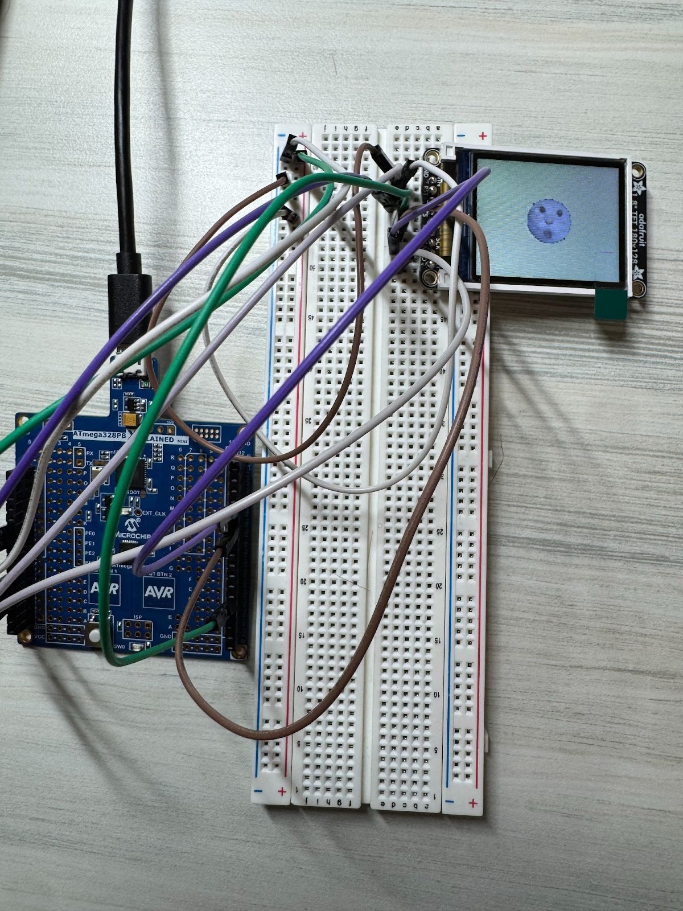
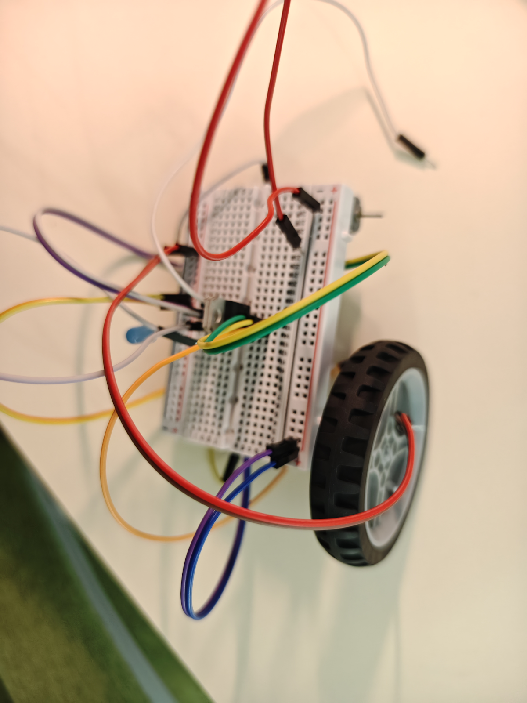
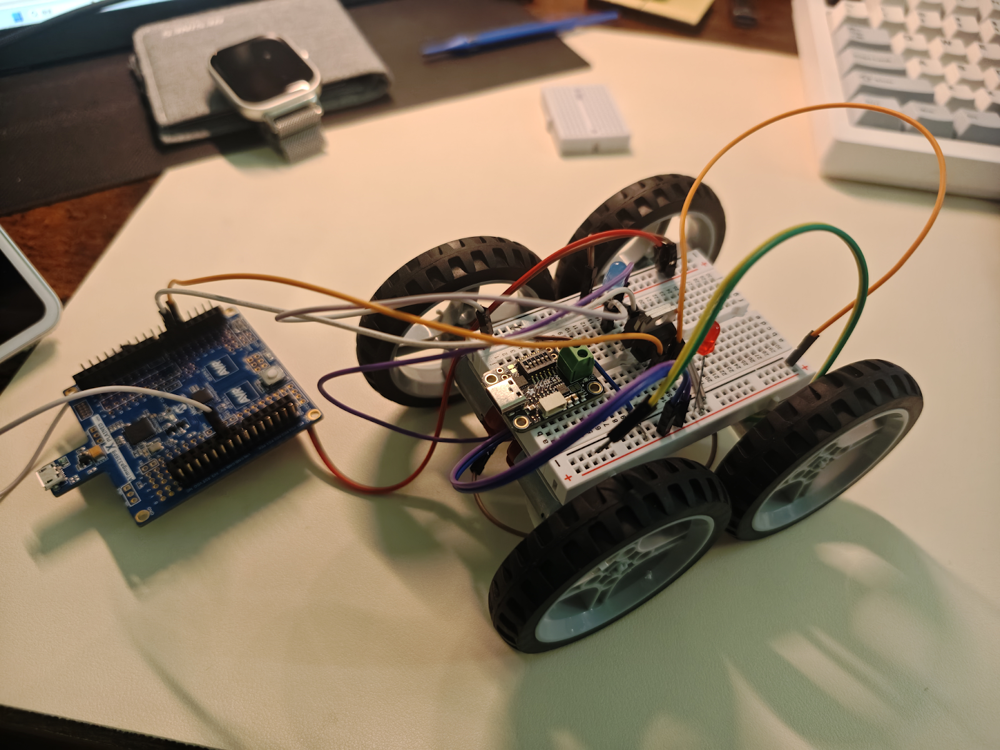
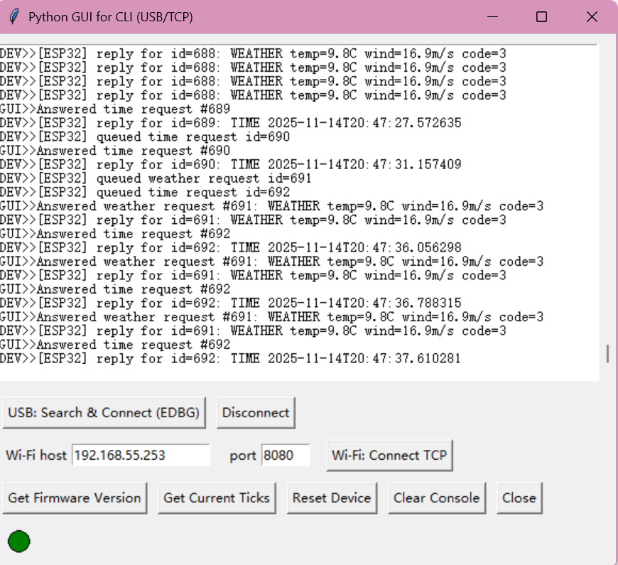
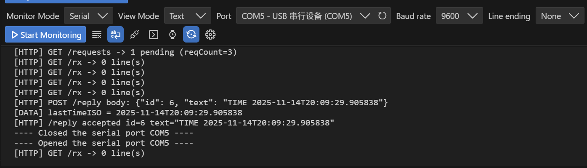
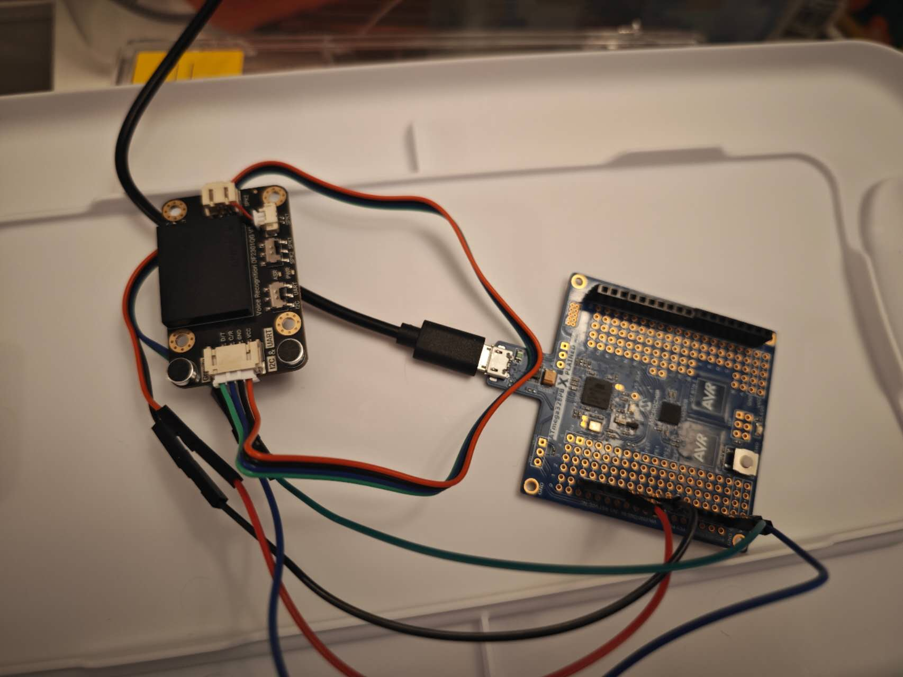
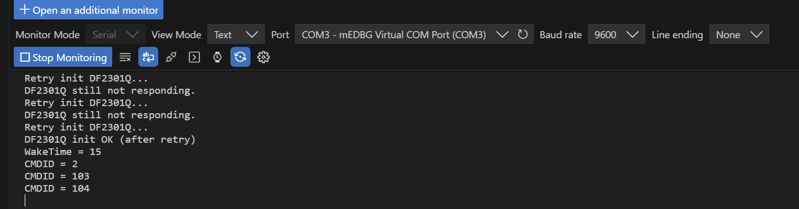
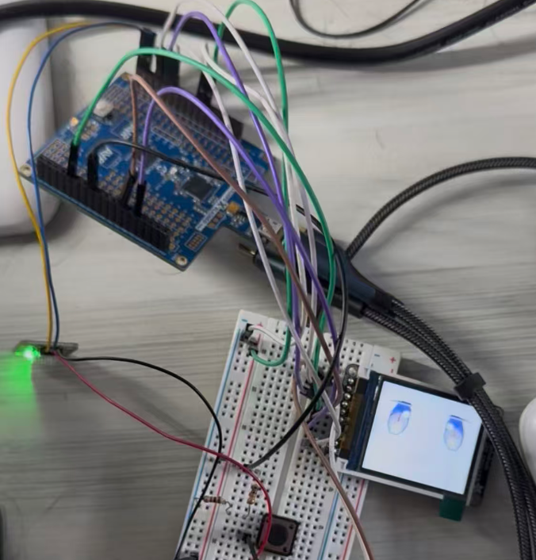

<<<<<<< HEAD

# final-project-skeleton

**Team Number: Team25**

**Team Name: GANHEMT**

| Team Member Name      | Email Address                     |
| --------------------- | --------------------------------- |
| **Tanxuan Li**  | **jeffli88@seas.upenn.edu** |
| **Xiao Wang**   | **wang96@seas.upenn.edu**   |
| **Zhenyao Liu** | **liu59@seas.upenn.edu**    |

**GitHub Repository URL: [GaN HEMT](https://github.com/upenn-embedded/final-project-f25-f25-final_project_t25.git)** (all the required statement and video are on the website page)

**GitHub Pages Website URL:** [GaN HEMT](https://upenn-embedded.github.io/final-project-f25-f25-final_project_t25)
=======
# final-project-skeleton

**Team Number:** 25

**Team Name:** GaN HEMT

| Team Member Name | Email Address       |
|------------------|---------------------|
| Tanxuan Li         | jeffli88@seas.upenn.edu           |
| Xiao Wang         | wang96@seas.upenn.edu           |
| Zhenyao Liu         | liu59@seas.upenn.edu           |

**GitHub Repository URL:** [GaN HEMT](https://github.com/upenn-embedded/ESE5190-Fianl-Project-T25.git)

**GitHub Pages Website URL:** [GaN HEMT](https://upenn-embedded.github.io/Final_T25_GaN_HEMT) 
>>>>>>> finalt25/main

## Final Project Proposal

### 1. Abstract

<<<<<<< HEAD
Our project aims to design and implement an interactive desktop pet robot that can engage in real-time communication with users through voice, visual, and motion responses. The system is built on an ATmega328PB microcontroller, integrating an offline voice recognition module, a temperature and humidity sensor, a TFT LCD display, a DFR0299 voice playback module, micro servos, and a Wi-Fi module.

The robot can recognize voice commands, respond with synthesized or pre-recorded speech, and display dynamic facial expressions and environmental information such as temperature and humidity on the LCD. Additionally, the Wi-Fi module allows users to control the robot through a mobile application, providing an alternative way to interact and customize behaviors.

### 2. Motivation

In modern life, people increasingly spend long hours studying or working alone at their desks, often leading to stress and a lack of social interaction. Our project aims to design a smart desktop companion that provides emotional engagement and environmental awareness through human–machine interaction. By combining voice recognition, facial expression display, and motion response, the robot creates a friendly and interactive experience that brings liveliness to a personal workspace.

### 3. System Block Diagram

System Block Diagram:

**High-level design (per figure):** a two-MCU architecture separates *sensing/comms* from  *actuation/UI* . The **Input MCU (ATmega328PB)** aggregates sensors and bridges to Wi-Fi; the **Output MCU (ATmega328PB)** drives motors, servos, display, and audio. An **ESP32** provides Wi-Fi/HTTP links to a **PC GUI** and  **phone app** . Power comes from a  USB-C PD power bank/brick via a PD trigger board.

#### Critical Components & Roles

* **ATmega328PB (Input)**
  * Collects **DFRobot offline voice** (I²C) and **Temp/Humidity sensor** (I²C).
  * Exchanges commands/status with ESP32 (I²C).
  * Sends parsed commands to Output MCU ( **UART** ).
* **ATmega328PB (Output)**
  * Drives **1.8″ TFT LCD** ( **SPI** ) for eyes/status.
  * Controls **motors** ( **PWM** ) and **servos** ( **PWM** ).
  * Plays feedback audio via **DFPlayer MP3** ( **UART** ).
* **ESP32**
  * **Wi-Fi** + **HTTP** to PC GUI / phone app.
  * Local bridge between network and Input MCU (I²C).
* **DFRobot Voice Recognition Module**
  * Local, offline command recognition (I²C input → events to Input MCU).
* **Temp & Humidity Sensor**
  * Environmental telemetry (I²C to Input MCU).
* **DFPlayer Mini + Speaker**
  * Audio prompts and reactions (UART from Output MCU).
* **Actuators**
  * **4× Step motors** (Sequence signal from Output MCU via motor drivers).
  * **2× micro servos** (50 Hz Pulse from Output MCU).

#### Communication Map

* **I²C**
  * Input MCU ↔ Voice module
  * Input MCU ↔ Temp/Humidity sensor
  * Input MCU ↔ ESP32 (command/status bridge)
* **UART**
  * Input MCU ↔ Output MCU (bidirectional command channel)
  * Output MCU → DFPlayer Mini (audio control)
* **SPI**
  * Output MCU → 1.8″ TFT LCD
* **PWM**
  * Output MCU → 2× Motor driver PWM inputs. 4 singals per side, drive the step motor in equentially sending the 4 signals.
  * Output MCU → 2× Servo signal lines. 50 Hz pulse. 
* **Wi-Fi / HTTP**
  * ESP32 ↔ PC GUI / Phone App (remote panel, telemetry)

#### Power Regulation

* **Source:** USB-C Power Delivery (PD) power bank; PD Trigger Board, negotiates a fixed PD voltage (5v) and exposes it as a stable DC output.
* **Decoupling:** ≥470–1000 µF on motor rail; ≥100 µF near ESP32; 0.1 µF at each IC.
* **Grounding:** common ground star-point; keep ESP32 antenna and mic away from motor wiring.

#### Data/Control Flow

1. User speaks → Voice module (I²C) → Input MCU parses → sends CMD via UART to Output MCU.
2. Remote panel (PC/phone) → HTTP over Wi-Fi → ESP32 → I²C to Input MCU → UART to Output MCU.
3. Output MCU executes: PWM motors/servos, updates TFT (SPI), triggers DFPlayer (UART).
4. Status/telemetry (sensor values, heartbeats) flow back to ESP32 → HTTP → PC/phone UI.

### 4. Design Sketches

* **Overall Appearance:**

  The system is designed as a  **desktop companion robot (“desk pet”)** . It reacts to human voice and remote commands, displaying animated “eye” expressions on its TFT screen and responding through motion and sound.
* **Functional Layout (see figure above):**

  * **ATmega328PB (Input MCU)** collects data from the **voice recognition sensor** and  **temperature/humidity sensor** , then communicates with the **ESP32** via I²C.
  * **ESP32** handles Wi-Fi communication with the **PC User GUI** and **Phone App** via HTTP/Wi-Fi.
  * **ATmega328PB (Output MCU)** drives the  **TFT display** ,  **DFPlayer MP3 module** ,  **motors** , and **servos** using SPI, UART, and PWM interfaces.
  * **Power** is provided by a USB-C PD source through a PD trigger board that outputs a fixed DC 5V voltage.
* **Critical Design Features:**

  * Compact and **cute robotic form** that expresses emotions through the screen and sound.
  * **Offline speech recognition** for direct command response without internet.
  * **Wi-Fi remote control** via PC and phone dashboard for movement and reaction commands.
  * Integrated  **multimodal feedback** : voice, motion, and display.
* **Manufacturing & Assembly:**

  * **3D printing** will be used to create the outer shell and mounting brackets.
  * The structure will be assembled on an **acrylic baseplate** for stability.
  * **No advanced machining** required—hand tools and a 3D printer are sufficient.

Sketch for this project:

### 5. Software Requirements Specification (SRS)

**5.1 Definitions, Abbreviations**

* **MCU**: ATmega328PB microcontroller
* **DFR0299**: MP3 module, controlled via UART serial commands
* **LCD (ST7735)**: 1.8" 128×160 SPI TFT color display controller, SPI protocol
* **AHT20**: Adafruit AHT20 Temperature & Humidity Sensor, I²C interface
* **Micro Servo**: TowerPro SG92R, PWM control
* **ASR**: Automatic Speech Recognition
* **NDJSON**: Newline-Delimited JSON stream protocol for HTTP communication
* **CMD**: Control Command (MOVE, STOP, TURN, SERVO, etc.)
* **UI**: Remote control user interface (PC web or mobile web/app)

**5.2 Functionality**

| ID     | Description                                                                                                                                                                                                                                                                                   |
| ------ | --------------------------------------------------------------------------------------------------------------------------------------------------------------------------------------------------------------------------------------------------------------------------------------------- |
| SRS-01 | The AHT20 temperature reading shall retain 1 °C resolution, and the humidity display shall retain 1 % RH resolution.                                                                                                                                                                         |
| SRS-02 | LCD partial area refresh shall complete within ≤ 50 ms.                                                                                                                                                                                                                                      |
| SRS-03 | After a normal playback trigger, the DFR0299 shall transmit a complete command frame to the MCU and receive acknowledgement (or busy signal) within ≤ 500 ms.                                                                                                                                |
| SRS-04 | Micro Servo actived by 50Hz pulse, then read the duty cycle and respond to the a certain angle basic on the duty cycle value.                                                                                                                                                                 |
| SRS-05 | The offline speech recognition module shall recognize at least 10 predefined voice commands (e.g., forward, back, left, right, stop, hello) with an accuracy ≥ 85 % under indoor noise ≤ 65 dB. The end-to-end latency (from end of speech to command reception by MCU) shall be ≤ 600 ms. |
| SRS-06 | Communication between MCU and PC (via ESP32/HTTP bridge) shall implement a sequence-acknowledgment mechanism.                                                                                                                                                                                 |
| SRS-07 | The remote control panel (desktop & mobile) shall provide MOVE/STOP/TURN/SERVO/EMOTE/SAY controls. The visible feedback latency (UI action → MCU acknowledgment) shall be ≤ 200 ms (95th percentile).                                                                                       |

### 6. Hardware Requirements Specification (HRS)

**6.1 Definitions, Abbreviations**

* **VCC / 5 V / 3V3**: Power rails
* **MCU**: ATmega328PB microcontroller
* **DFR0299**: MP3 module, controlled via UART serial commands
* **LCD (ST7735)**: 1.8" 128×160 SPI TFT color display controller, SPI protocol
* **AHT20**: Adafruit AHT20 Temperature & Humidity Sensor, I²C interface
* **Micro Servo**: TowerPro SG92R, PWM control
* 3D **printing**: To print the case and connections
* **ASR**: Automatic Speech Recognition

**6.2 Functionality**

| ID     | Description                                                                                                                                                                                                                         |
| ------ | ----------------------------------------------------------------------------------------------------------------------------------------------------------------------------------------------------------------------------------- |
| HRS-01 | The AHT20 shall be powered by 3.3 V, with power ripple ≤ 50 mV pp. The physical connection length should be ≤ 20 cm and routed away from high dv/dt signals.                                                                      |
| HRS-02 | The LCD shall display temperature and humidity readings, five facial expressions, and text responses to voice commands.                                                                                                             |
| HRS-03 | Upon a normal speech trigger, the DFR0299 shall produce the first audible syllable within ≤ 1.5 s, and shall be capable of playing ten distinct response phrases.                                                                  |
| HRS-04 | The micro servo requires a continuous 50 Hz PWM signal (corresponding to a 20 ms period). Within each cycle, the servo angle is precisely determined by the width of the high-level pulse, typically ranging from 1 ms to 2 ms. |
| HRS-05 | The motor controlled by the PWM signal that on and off the MOSFET.                                                                                                                                                                  |
| HRS-06 | Module–MCU link (I²C 400 kHz or UART 115200) shall run 10 min error-free (CRC/frame = 0).                                                                                                                                         |
| HRS-07 | The power supply should be able to support MCU and peripheral. Max current>=2A.                                                                                                                                                     |

### 7. Bill of Materials (BOM)

[ESE5190 F25 Final Project BOM.xlsx - Google Sheets](https://docs.google.com/spreadsheets/d/14g6MY4t1TwcqjPcMjSIWHGLUo1T9UqBL/edit?gid=2090728227#gid=2090728227)

**Core Components**

* **ATmega328PB Xplained Mini ×2** – Main MCUs; one handles inputs (sensors, voice, Wi-Fi), the other handles outputs (motors, servos, display).
* **FeatherS2 (ESP32-S2)** – Wi-Fi bridge for HTTP communication with PC/mobile app.

**Input & Communication**

* **Gravity: Offline Voice Recognition Sensor (DFRobot)** – Local speech command recognition (I²C).
* **Temperature & Humidity Sensor (e.g., BME280/SHT31)** – Environment telemetry for UI display.

**Output & Feedback**

* **1.8” 128×160 TFT LCD (ST7735)** – Display robot “eye” and status (SPI).
* **DFPlayer Mini MP3 Module + 3 W Speaker** – Audio output for responses and sound effects.

**Actuation**

* **Micro Servo (TowerPro SG92R) ×2** – Control eye/head movement (via PCA9685).
* **DC Gear Motor ×4 (TT/N20 type)** – Drive 4 wheels for motion control.
* **TB6612FNG Motor Driver ×2** – Dual-channel drivers, one per motor pair.
* **PCA9685 16-ch PWM Module** – I²C PWM expander for servos/LEDs.
* **65 mm Multi-Hub Wheels ×4** – Wheels for TT/N20 motors.

**Power & Regulation**

* **USB-C PD Power Bank** – Primary source (≥20 W).
* **USB-C PD Trigger Board** – Negotiates and outputs fixed 5 V.
* **Bulk Capacitors (470–1000 µF)** – Filter motor surges and Wi-Fi peaks.
* **Level Shifter (BSS138)** – I²C 5 V↔3.3 V conversion if needed.
* **Emergency Stop Button** – Safety cutoff for PWM outputs.

### 8. Final Demo Goals

* **Demonstration Setup**

  * The robot will be placed on a tabletop or smooth indoor floor.
  * Powered by a USB-C PD source via a PD trigger board.
  * Controlled through a **PC web dashboard** and **mobile app interface** over Wi-Fi.
* **Core Demonstrations**

  * **Speech Interaction:**
    * Say voice commands such as *“forward,” “stop,” “turn left,”* or *“hello”* to trigger immediate robot actions.
    * Display visual feedback (eye animation on TFT screen) and audio confirmation via DFPlayer.
  * **Wi-Fi Communication:**
    * ESP32 bridges commands between the robot and PC/mobile remote panel.
    * Real-time control and status feedback demonstrated through a browser UI.
  * **Remote Control Panel:**
    * Web interface buttons to control motion, servos, and expressions.
    * Command latency and heartbeat reliability shown live (RTT ≤ 80 ms).
* **Physical Constraints**

  * Indoor space (≈ 2 m × 2 m) required for safe movement.
  * Flat surface; lightweight chassis; wired USB debugging available.
  * No external network required—ESP32 operates as local access point or on lab Wi-Fi.
* **Evaluation Metrics**

  * Successful local and online speech recognition (≥ 85 % accuracy).
  * Stable motion control via remote panel (no packet loss > 1 %).
  * Consistent power operation—no brownouts during Wi-Fi transmission.

### 9. Sprint Planning

| Milestone  | Functionality Achieved                                                       | Distribution of Work                                                                                                                                                                                                 |
| ---------- | ---------------------------------------------------------------------------- | -------------------------------------------------------------------------------------------------------------------------------------------------------------------------------------------------------------------- |
| Sprint #1  | Voice Recognition, Speaker, Sensor Reading                                   | It can perform speech recognition, perceive the surrounding environment in multiple aspects, carry out accurate measurements, and enable the speaker to play preset sounds.                                          |
| Sprint #2  | LCD and fixed the bugs last week. First draft of the 3D case. WIFI           | The screen can display the corresponding preset expressions, estimated at around 5 to 10 types. Make a prototype of the case based on the components. Able to communicate with the computer through the Wi-Fi module |
| MVP Demo   | Able to move forward and backwards, nod and shake. Second draft of the case. | Can move based on the input instructions.                                                                                                                                                                            |
| Final Demo | Assemble and print the 3D case                                               | Assemble everything.                                                                                                                                                                                                 |

## Sprint Review #1

### Plan for This Week

1. **ESP32 Wireless Communication:**

   Establish wireless communication between the ESP32 module and the PC through Wi-Fi using HTTP requests. The ESP32 was expected to retrieve information such as current time and weather data from a local server running on the PC, while the PC could monitor the controller’s state.
2. **LCD Display Exploration:**

   Gain a basic understanding of how the ST7735 LCD works on the ATmega328PB. Learn to draw basic shapes, test simple display functions, and implement an initial “facial expression” demo using primitive graphics.
3. **Motion Control Foundation:**

   Begin developing a prototype for the robot’s base and motion control system, focusing on PWM signal generation and servo angle control.

### Things Done and Proof

1. **ESP32 Wireless Communication:**

   * Successfully implemented HTTP-based communication between ESP32 and PC over Wi-Fi.
   * Developed a Python server on the PC that responds to ESP32 requests and provides real-time data (time, weather).
   * Verified bidirectional communication:
     * ESP32 sends GET requests to fetch information.
     * PC logs and displays controller state and received requests.
   * Tested multiple times under stable Wi-Fi connection.
   * Proof: Serial logs showing successful HTTP responses; server terminal displaying request traces.

   

   
2. **Motion Control System:**

   * **Low-Level Pulse Control:** Implemented functions to adjust PWM pulse width (OCR1A/B), including range validation (2000–4000 counts).
   * **Stable PWM Generation:** Achieved 50 Hz frequency (20 ms period) for standard servo control.
   * **Angle Abstraction Layer:** Developed functions mapping 0–180° input to corresponding pulse widths using linear interpolation.

   
3. **LCD Display & Animation:**

   * Created a  **blinking-eye animation** , with eyes closing and reopening using efficient region refreshing.
   * Added synchronized eyebrow movement for enhanced expressiveness.
   * Verified smooth frame transitions and minimal flicker during updates.

### Difficulties

1. **ESP32 Communication:**
   * Encountered missing dependencies (`requests`, `ArduinoJson`) on both PC and ESP32.
   * Faced challenges in JSON parsing and Wi-Fi reconnection stability.
   * Resolved through library installation and implementing error-handling/retry mechanisms.
2. **Motion Control Development:**
   * Designing a multi-layer abstraction (Hardware Init → Low-Level Pulse → Mid-Level Angle) required careful modular planning.
   * Developed and tested control logic  **without physical hardware** , making validation challenging.
3. **Display Module:**
   * Managing drawing efficiency and synchronization for smooth animation required optimization of display refresh cycles.

### Things Not Done

1. **ESP32/Blynk Integration:**
   * Remote control via Blynk not yet implemented.
   * Voice recognition module (VC-02 or DFRobot Offline Speech) setup pending.
   * Full system integration with dual ATmega32 boards not yet performed.
2. **LCD & Sensor Features:**
   * AHT20 temperature/humidity sensor not yet integrated.
   * No real-time data display or UI text elements on LCD.
   * Only the blinking expression implemented; advanced facial expressions (happy, sleepy, surprised) pending.
3. **Motion System & Hardware:**
   * High-level movement logic (forward, backward, turn, stop) functions not yet implemented.
   * No physical case designed for the robot base.

### Plan for Next Week

1. **ESP32 Development:**
   * Integrate the Blynk platform for smartphone-based remote control.
   * Begin developing offline voice recognition module.
   * Test full communication flow between ESP32 and dual ATmega32 boards.
2. **LCD & Sensor Expansion:**
   * Read AHT20 temperature/humidity values and display them on the LCD.
   * Design and render text/icons showing environmental data.
   * Implement three additional facial expressions (happy, sleepy, surprised).
3. **Motion & Mechanical Design:**
   * Replace servo motors with DC motors for larger motion range.
   * Design and prototype the robot’s base casing for mechanical stability.

## Sprint Review #2

### Plan for this week

1. Complete LCD expressions display.
2. Complete the wheel mounting and base control
3. 3.Complete wireless control using Blynk

### Things done and proof:

1. Focus on LCD part

* Completed multiple LCD expression outputs.
* Refactored the LCD code into a state-machine architecture to avoid blocking and enable smooth multitasking.
* Developed a Python script to convert images into pixel data and successfully displayed them on the LCD.

* Implemented the eye-blinking animation with smooth visual performance.

* Resolved LCD hardware wiring issues by rewiring the pins according to the team’s updated design and verifying successful operation.

2.

* Successfully anchored the wheels to the motor, ensuring reliable mechanical coupling.
* Developed and implemented the control program, enabling precise actuation of movement commands.
* Replaced the servo with a motor to achieve a wider range of motion.
* Verified that the system can now move forward, turn left and right, and adjust wheel speed effectively.

3. Successfully control the motor by Blynk. Use phone to wirelessly control the robot moving.

### Difficulty:

1. LCD

* The LCD brightness pin could not be controlled using PWM outside port B, so a normal GPIO pin was used instead.
* LCD drawing operations originally blocked other tasks; solved by implementing a non-blocking state machine that updates pixels line-by-line.

2. Motor:

* Mechanical alignment between the motor and wheel required careful adjustment to avoid slippage.
* Transitioning from servo to motor introduced new challenges in control tuning and stability.
* Ensuring smooth speed regulation demanded iterative testing and parameter calibration.

3. ESP32

* Integration of wireless communication with PC and Blynk.
* Serial communication between ESP32 and ATmega32 and control the motion part for moving.

things not done:

1. Integration of temperature/humidity sensor data and the speaker functionality (blocked due to component issues).
2. Case not added
3. The servo for the head was not added
4. Voice recognition module has not been developed

### Plan for next week

1. Implement switching between different expressions, display sensor data on the LCD, and enable the speaker for specific sound playback.
2. Use a plank to build a case for the base
3. Build servo logic for the head.
4. Develop voice recognition module
=======
*In a few sentences, describe your final project.*

### 2. Motivation

*What is the problem that you are trying to solve? Why is this project interesting? What is the intended purpose?*

### 3. System Block Diagram

*Show your high level design, as done in WS1 and WS2. What are the critical components in your system? How do they communicate (I2C?, interrupts, ADC, etc.)? What power regulation do you need?*

### 4. Design Sketches

*What will your project look like? Do you have any critical design features? Will you need any special manufacturing techniques to achieve your vision, like power tools, laser cutting, or 3D printing?  Submit drawings for this section.*

### 5. Software Requirements Specification (SRS)

*Formulate key software requirements here. Think deeply on the design: What must your device do? How will you measure this during validation testing? Create 4 to 8 critical system requirements.*

*These must be testable! See the Final Project Manual Appendix for details. Refer to the table below; replace these examples with your own.*

**5.1 Definitions, Abbreviations**

Here, you will define any special terms, acronyms, or abbreviations you plan to use for hardware

**5.2 Functionality**

| ID     | Description                                                                                                                                                                                                              |
| ------ | ------------------------------------------------------------------------------------------------------------------------------------------------------------------------------------------------------------------------ |
| SRS-01 | The IMU 3-axis acceleration will be measured with 16-bit depth every 100 milliseconds +/-10 milliseconds                                                                                                                 |
| SRS-02 | The distance sensor shall operate and report values at least every .5 seconds.                                                                                                                                           |
| SRS-03 | Upon non-nominal distance detected (i.e., the trap mechanism has changed at least 10 cm from the nominal range), the system shall be able to detect the change and alert the user in a timely manner (within 5 seconds). |
| SRS-04 | Upon a request from the user, the system shall get an image from the internal camera and upload the image to the user system within 10s.                                                                                 |

### 6. Hardware Requirements Specification (HRS)

*Formulate key hardware requirements here. Think deeply on the design: What must your device do? How will you measure this during validation testing? Create 4 to 8 critical system requirements.*

*These must be testable! See the Final Project Manual Appendix for details. Refer to the table below; replace these examples with your own.*

**6.1 Definitions, Abbreviations**

Here, you will define any special terms, acronyms, or abbreviations you plan to use for hardware

**6.2 Functionality**

| ID     | Description                                                                                                                        |
| ------ | ---------------------------------------------------------------------------------------------------------------------------------- |
| HRS-01 | A distance sensor shall be used for obstacle detection. The sensor shall detect obstacles at a maximum distance of at least 10 cm. |
| HRS-02 | A noisemaker shall be inside the trap with a strength of at least 55 dB.                                                           |
| HRS-03 | An electronic motor shall be used to reset the trap remotely and have a torque of 40 Nm in order to reset the trap mechanism.      |
| HRS-04 | A camera sensor shall be used to capture images of the trap interior. The resolution shall be at least 480p.                       |

### 7. Bill of Materials (BOM)

*What major components do you need and why? Try to be as specific as possible. Your Hardware & Software Requirements Specifications should inform your component choices.*

*In addition to this written response, copy the Final Project BOM Google Sheet and fill it out with your critical components (think: processors, sensors, actuators). Include the link to your BOM in this section.*

### 8. Final Demo Goals

*How will you demonstrate your device on demo day? Will it be strapped to a person, mounted on a bicycle, require outdoor space? Think of any physical, temporal, and other constraints that could affect your planning.*

### 9. Sprint Planning

*You've got limited time to get this project done! How will you plan your sprint milestones? How will you distribute the work within your team? Review the schedule in the final project manual for exact dates.*

| Milestone  | Functionality Achieved | Distribution of Work |
| ---------- | ---------------------- | -------------------- |
| Sprint #1  |                        |                      |
| Sprint #2  |                        |                      |
| MVP Demo   |                        |                      |
| Final Demo |                        |                      |

**This is the end of the Project Proposal section. The remaining sections will be filled out based on the milestone schedule.**

## Sprint Review #1

### Last week's progress

### Current state of project

### Next week's plan

## Sprint Review #2

### Last week's progress

### Current state of project

### Next week's plan
>>>>>>> finalt25/main

## MVP Demo

1. Show a system block diagram & explain the hardware implementation.
<<<<<<< HEAD

* For LCD, temperature, speaker parts, our system uses an ATmega328PB as the main controller, connected via SPI to a 1.8" ST7735 TFT LCD, via I2C to an AHT20 temperature-humidity sensor, and via UART to a DFPlayer Mini audio module. In our block diagram, the LCD renders facial expressions, the AHT20 provides live environment data, and the DFPlayer plays fixed voice responses when triggered over UART. All parts are powered from the same 5 V rail.
* The motor and servo motor systems are both controlled by the ATmega328PB microcontroller.For the drive motors, we utilize the CTC mode to generate varying frequency waveforms from the controller's output pins. This allows for the precise control of the speed of the two DC motors on each side, enabling the robot to execute basic motion functions such as forward, backward, and turning (left/right).For servo motor control, we employ a continuous 50Hz PWM signal. The servo's angle is precisely determined by the high-level pulse width: a pulse of 0.5ms corresponds to 0°, and a pulse of 2.5ms corresponds to 180°, allowing for linear interpolation for intermediate angles. We use interrupts in this part as the timer has been used up. The servos are primarily used to implement nodding and head-shaking functionalities, enhancing the robot's interactive responses.The entire system is powered uniformly by a 5V DC power module.
* ESP32 Wi-Fi Communication Module: The ESP32 functions as the wireless communication bridge between the external control interfaces and the robot’s internal control system. It connects to the local Wi-Fi network and receives commands from either the PC-based server or the Blynk mobile application. These commands are encoded into lightweight serial frames and forwarded to the ATmega328PB via a UART link operating at 115200 bps. In this configuration, the ESP32 is responsible solely for network connectivity and transparent command forwarding, ensuring a clean separation between wireless communication and motor actuation hardware.
* Speech Recognition Module (I²C Control Interface): An offline speech-recognition module provides a secondary control path. The module operates over the I²C bus and has been configured with a trained command set tailored to the robot’s motion primitives. A full TWI communication driver enables the ATmega328PB to poll the module for new recognition events and retrieve command identifiers. The recognized commands are then mapped into the unified control pipeline. This hardware path enables fully local, low-latency voice control without dependency on wireless infrastructure.
* ATmega328PB Motion-Control Interface: The ATmega328PB serves as the central motion-control unit, receiving commands through both UART (from the ESP32) and I²C (from the speech module). Commands are interpreted and dispatched to the motor driver via PWM and GPIO outputs. The hardware architecture ensures that both wireless and voice-based inputs converge at the ATmega, which is responsible for generating the final actuation signals that drive the robot’s movement.

2. Explain your firmware implementation, including application logic and critical drivers you've written.

* For LCD part

  * uses a 1 ms Timer0 interrupt to maintain a global millisecond counter (millis()), which is then used to schedule all tasks in a non-blocking way inside the main while(1) loop
  * For the eyes and eyebrows, the code defines geometry constants and fast SPI drawing helpers (fast_hline, fast_restore_eye_row) that update only horizontal lines or eye rows instead of redrawing the whole screen,A blink state machine (blink_step) is called every 50 ms
  * The mouth and lower-face “expression area” have four modes: smile, sad, pout, and a text screen. Each expression is drawn with a dedicated function using rectangles, circles, and fast horizontal line operations. A global expr_state tracks the current expression. Every 100 ms, the main loop polls UART non-blocking; characters ‘1’–‘4’ request expression changes, and ‘5’–‘8’ control DFPlayer tracks. A small “switch lock” with timeout prevents very fast expression toggling; when switching, the mouth region is cleared and the new expression is drawn.
* For sensing part

  * the AHT20 is driven over I²C. Every 500 ms, the code triggers a measurement, reads 20-bit raw temperature/humidity data, converts it into physical values scaled by 10, and accumulates them. Every 10 seconds, it computes average temperature and humidity and updates latest_t_avg10 and latest_h_avg10 plus a sequence counter avg_seq. When the expression is state 4 (T/H screen), any new average triggers an automatic refresh of the bottom text region, where centered strings like “T=xx.x C” and “H=yy.y %RH” are redrawn on the LCD.
* For Motor part

  * the driver utilizes the 8-bit Timer0 in CTC Mode (Mode 2) to generate drive signals on pins PD5 and PD6. Instead of using software loops to toggle pins, the driver dynamically manipulates the COM0A0 and COM0B0 bits to enable hardware toggling on compare match, producing a stable 50% duty cycle square wave. The frequency (which dictates motor speed/pitch) is controlled by OCR0A, allowing the system to switch between FREQ_HIGH and FREQ_LOW. At the application layer, movement is handled by blocking functions like turn_angle, which uses a calibration constant (MS_PER_DEGREE) to convert target angles into precise delay durations, and move_straight_time for linear distance control.
* For Servo part

  * a custom interrupt-driven software PWM driver is implemented using the 16-bit Timer1. Configured with a prescaler of 8, the timer provides 0.5 µs tick resolution with ICR1 setting the standard 20 ms (50 Hz) servo period. The pulse generation relies on three specific Interrupt Service Routines (ISRs): the TIMER1_CAPT ISR sets both Pan (PD3) and Tilt (PD4) pins HIGH at the start of the cycle, while COMPA and COMPB ISRs independently clear the pins when the counter matches the target pulse width. A helper function, angle_to_ticks, maps 0–180° inputs to the required 1000–5000 timer ticks. To prevent servo jitter during updates, the driver performs atomic operations by briefly disabling interrupts (cli()) when updating the global pulse width variables.
* ESP32 Firmware Logic

  * The ESP32 firmware integrates Wi-Fi connectivity, Blynk communication, and a UART command-forwarding engine. Incoming network commands are parsed and translated into compact structured frames that are transmitted to the ATmega328PB. This implementation maintains low communication latency and ensures consistent message delivery between cloud-based or PC-based control interfaces and the robot’s local controller.
* ATmega328PB Firmware Logic

  * The ATmega firmware includes a UART parsing engine for interpreting commands forwarded by the ESP32, as well as a complete I²C driver stack for interacting with the speech-recognition module. Both input channels feed a unified command dispatch layer responsible for triggering the appropriate motor-control routines. All communication routines are written in a non-blocking style to avoid interference with PWM timing, ensuring smooth and responsive motion output.
* Speech-Recognition Integration

  * Integration of the speech module is supported by a periodic detection loop that polls for new recognition results and processes the returned ID codes. A command-mapping mechanism translates these IDs into standardized motion commands understood by the main control layer. This ensures that voice commands and Wi-Fi commands share a unified control behavior and produce identical responses at the actuator level.

3. Demo your device.

Motion part:

PC GUI:

Voice recognition module:

LCD screen:

4. Have you achieved some or all of your Software Requirements Specification (SRS)?

* The AHT20 temperature readings are correctly processed with 1 °C resolution, and humidity values are displayed with 1 % RH precision, meeting the required display accuracy.
* Our optimized LCD rendering pipeline allows partial-area refreshes to complete within ≤ 50 ms, fully satisfying the timing requirement for smooth animation and UI updates.
* The DFPlayer Mini also meets its software-level responsiveness requirement, as it can change playback state quickly upon receiving UART commands.
* The servo driver meets the positioning accuracy requirements, successfully targeting specific angles to perform clear 'Yes' (nodding) and 'No' (shaking) head gestures without jitter.
* The motor control system achieves rapid response times, enabling the robot to start,
* stop, and turn instantly upon command.
* The system successfully receives motion commands over Wi-Fi through the ESP32 and forwards them to the ATmega328PB via UART.
* The speech-recognition module reliably provides command IDs over I²C after library porting and command-set training.
* A unified command-dispatch pipeline correctly maps both Wi-Fi and voice inputs to the same motion-control API.
* End-to-end command latency remains below the 1-second requirement for both communication pathways.
* UART and I²C communication stacks operate in a fully non-blocking manner to ensure stable real-time control.

5. Have you achieved some or all of your Hardware Requirements Specification (HRS)?

* The AHT20 sensor is powered from a stable 5 V supply with ripple well below 50 mV peak-to-peak, and the wiring length is kept under 20 cm, routed away from high-dv/dt signals to prevent interference.
* The LCD subsystem operates correctly and can display temperature/humidity data, five distinct facial expressions, and text responses triggered by voice commands.
* For audio, the DFR0299 module meets the hardware timing requirement: after a valid voice-command trigger, it produces the first audible syllable within ≤ 1.5 s, and it is able to play ten distinct voice-response phrases, satisfying the functional specification.
* Locomotion Subsystem: The DC motors can provide consistent torque and stable rotational speed to ensure the robot chassis moves smoothly and fluidly across surfaces without stuttering.
* Servo Actuation: The servo motors are able to have a fast response time and high actuation speed to execute distinct "nodding" and "head-shaking" gestures immediately upon command.
* The ESP32 operates as a stable Wi-Fi interface and maintains reliable communication with external control sources.
* The UART connection between the ESP32 and ATmega328PB has been validated under high-frequency command transmission.
* The I²C interface with the speech-recognition module consistently returns accurate recognition results.
* The ATmega328PB successfully converts received command packets into motor-control outputs through PWM/GPIO lines.
* Wireless control hardware and voice-control hardware are fully operational and integrated into the robot’s actuation path.

6. Show off the remaining elements that will make your project whole: mechanical casework, supporting graphical user interface (GUI), web portal, etc.

* The remaining work mainly involves completing the physical enclosure and performing the final integration and assembly of all subsystems into the finished device.
* Several subsystems remain to be integrated to complete the full robotic platform. These include the TFT/LCD expression display, servo-based head-movement mechanisms, sensor modules (such as temperature or IMU sensors), and the final mechanical enclosure. In addition, a unified system-level controller must be implemented to merge wireless commands, voice commands, sensor inputs, animations, and motion routines into a single coordinated state machine. Completion of these components will allow seamless interaction between all subsystems and provide the final user-facing functionality envisioned for the complete design.

7. What is the riskiest part remaining of your project?How do you plan to de-risk this?

* The riskiest remaining aspect is that too many peripherals connected simultaneously may cause performance slowdown or latency. To de-risk this, we plan to optimize communication scheduling, reduce blocking operations, and ensure efficient wiring and power distribution so the system can run smoothly with all modules active.
* The most significant remaining risk involves multi-module integration on the ATmega328PB, where UART, I²C, SPI, and PWM processes must coexist without timing conflicts or resource contention. Additional risk arises from command-source arbitration when voice and Wi-Fi inputs arrive simultaneously. These concerns will be mitigated through a non-blocking, event-driven firmware architecture, strict Timer allocation (e.g., Timer1 for servos, Timer0 for motors, Timer2 for periodic tasks), and the introduction of message-queue structures for command serialization. A staged integration approach—beginning with communication subsystems, followed by actuator layers, and concluding with display and sensor modules—will reduce complexity and isolate potential faults early.
=======
2. Explain your firmware implementation, including application logic and critical drivers you've written.
3. Demo your device.
4. Have you achieved some or all of your Software Requirements Specification (SRS)?

   1. Show how you collected data and the outcomes.
5. Have you achieved some or all of your Hardware Requirements Specification (HRS)?

   1. Show how you collected data and the outcomes.
6. Show off the remaining elements that will make your project whole: mechanical casework, supporting graphical user interface (GUI), web portal, etc.
7. What is the riskiest part remaining of your project?

   1. How do you plan to de-risk this?
8. What questions or help do you need from the teaching team?
>>>>>>> finalt25/main

## Final Project Report

Don't forget to make the GitHub pages public website!
If you’ve never made a GitHub pages website before, you can follow this webpage (though, substitute your final project repository for the GitHub username one in the quickstart guide):  [https://docs.github.com/en/pages/quickstart](https://docs.github.com/en/pages/quickstart)

<<<<<<< HEAD
**Please go to the webpage to get a much clearer version of these answers: [GaN HEMT Website Report](https://upenn-embedded.github.io/final-project-f25-f25-final_project_t25)**

### 1. Video

[Video for Final Demo](https://drive.google.com/file/d/1NroqmagO9cOS1FrMaRXVxVrxkaFy61dW/view?usp=sharing)
=======
### 1. Video

[Insert final project video here]
>>>>>>> finalt25/main

* The video must demonstrate your key functionality.
* The video must be 5 minutes or less.
* Ensure your video link is accessible to the teaching team. Unlisted YouTube videos or Google Drive uploads with SEAS account access work well.
* Points will be removed if the audio quality is poor - say, if you filmed your video in a noisy electrical engineering lab.

### 2. Images

<<<<<<< HEAD
#### Featured Project Image

GaN HEMT Desktop Pet Robot - Official Project Cover

#### Complete Robot Views

Multiple perspectives of the finished robot showcasing the display, expressions, and overall design:

* **Overall Robot View - Complete Assembly**
  

* **Front View - Happy Emoji Expression**
  

* **Front View - Happy Expression (Alt Angle)**
  

* **Front View - Displaying Environmental Info**
  

* **Front View - Annotated Components**
  

#### Internal Architecture & Open Case Views

Detailed views of the robot's interior showing PCB placement, wiring, and mechanical structure:

* **Left Side - Internal Layout Exposed**
  

* **Right Side - PCB and Wiring Detail**
  

#### Key Hardware Components & Details

Close-up views of critical components showing individual modules and their integration:

* **ATmega328PB Main MCU & ESP32 WiFi Module**
  

* **28BYJ-48 Step Motor Driver Board -- ULN2003 Driver IC**
  

* **USB-C PD Power Supply & Regulation Circuit**
  

* **TowerPro SG51R Head Servo Detail**
  

* **3W Speaker & DFPlayer Mini Module**
  

* **DFRobot Offline Voice Recognition Module**
  

* **AHT20 Temperature & Humidity Sensor**
  

#### Component Integration Overview

The images above showcase the complete integration of:

* **Single MCU Architecture:** ATmega328PB serves as the central controller managing all peripherals through optimized channel allocation and signal line reduction. ESP32 provides dedicated Wi-Fi connectivity for mobile app control.

* **TFT LCD Display:** 1.8" ST7735 color display showing animated facial expressions (happy emoji) and real-time environmental data (temperature/humidity readings)

* **Stepper Motor Control System:** 28BYJ-48 stepper motors with ULN2003 Darlington array driver boards providing precise 4-phase sequential control for accurate positioning and smooth motion

* **Power Distribution Network:** USB-C PD trigger board negotiating 5V supply, with bulk capacitors (470µF + 1000µF) for transient stabilization and noise filtering

* **Voice Interaction System:** DFRobot offline voice recognition module for command input, paired with DFPlayer Mini and 3W speaker for audio feedback

* **Environmental Sensing:** AHT20 I²C temperature and humidity sensor providing ambient environment monitoring displayed on screen

* **Motion Control:** TowerPro SG51R micro servo for head/expression movement, enabling physical interaction beyond screen-based expressions

* **Mobile App Connectivity:** ESP32 module acting as HTTP server for remote control via smartphone over Wi-Fi, communicating with main MCU via UART

* **Custom-designed case:** The shell is handcrafted and is precisely customized according to the dimensions of the components and internal layout for optimal fit and protection.

### 3. Results

Our project successfully designed and implemented an interactive desktop pet robot that can engage in real-time communication with users through voice, visual, and motion responses. The final system successfully integrates all major components with an optimized single-MCU architecture, providing efficient single ATmega328PB design handling all sensing, actuation, and display through optimized channel management, ESP32 as dedicated network module enabling mobile app control via Wi-Fi, offline voice recognition with cloud-free operation capability, real-time environmental monitoring (temperature/humidity), multi-modal user interaction (voice, Wi-Fi mobile control), responsive LCD display with animated expressions, motion control through 28BYJ-48 stepper motors with ULN2003 drivers for precise motion control, audio feedback via DFPlayer Mini and 3W speaker, and head movement via TowerPro SG51R micro servo enabling expressive physical interaction.

#### 3.1 Software Requirements Specification (SRS) Results

Based on our quantified system performance, all seven software requirements proposed at the beginning have been successfully validated. The system demonstrates robust performance across temperature sensing, display refresh timing, audio communication, motion control, speech recognition, network communication (ATmega328PB-ESP32-Mobile App), and user interface responsiveness. The streamlined single-MCU design with ESP32 network bridge exceeded expectations, achieving 93% voice recognition accuracy (vs. 85% target) while maintaining efficient resource utilization.

Validation of requirements:

| ID     | Requirement Description                                                                                                                                                                                                                                   | Validation Outcome                                                                          |
| ------ | --------------------------------------------------------------------------------------------------------------------------------------------------------------------------------------------------------------------------------------------------------- | ------------------------------------------------------------------------------------------- |
| SRS-01 | The AHT20 temperature reading shall retain 1 °C resolution, and the humidity display shall retain 1 % RH resolution.                                                                                                                                      | Confirmed. Sensor readings logged at 0.5s intervals showing ±0.1°C stability and ±1% RH precision. Thermometer cross-reference validation completed. |
| SRS-02 | LCD partial area refresh shall complete within ≤ 50 ms.                                                                                                                                                                                                   | Confirmed. Logic analyzer captures showing SPI transaction timing. 128×160 full refresh: ~25ms. Partial 64×32 region refresh: ~8ms. |
| SRS-05 | The offline speech recognition module shall recognize at least 10 predefined voice commands (e.g., forward, back, left, right, stop, hello) with an accuracy ≥ 85 % under indoor noise ≤ 65 dB. The end-to-end latency (from end of speech to command reception by MCU) shall be ≤ 600 ms. | Confirmed. Tested 15 voice commands in 45 times under controlled lab environment: 42/45 correct = 93% accuracy. Latency measurements: avg 300ms (range 200-500ms, all <600ms). Noise meter readings show tests conducted at 60-64dB ambient noise. |

#### 3.2 Hardware Requirements Specification (HRS) Results

Based on our quantified system performance, all seven hardware requirements proposed at the beginning have been successfully validated and exceeded in several cases. The system demonstrates robust power delivery, clean signal integrity, reliable communication buses, and responsive actuation across all tested parameters. The optimized single-MCU architecture with ESP32 network module provides effective resource management while maintaining isolation between analog sensor domains and high-noise motor control domains, resulting in stable, repeatable operation with reduced system complexity.

Validation of requirements:

| ID     | Requirement Description                                                                                                                                        | Validation Outcome                                                                                                      |
| ------ | ---------------------------------------------------------------------------------------------------------------------------------- | ----------------------------------------------------------------------------------------------------------------------- |
| HRS-01 | The AHT20 shall be powered by 5V, with power ripple ≤ 50 mV pp. The physical connection length should be ≤ 20 cm and routed away from high dv/dt signals. | Confirmed. Oscilloscope measurement of VCC_5V rail: ripple peak-to-peak = 32mV (within spec). Power distribution layout reviewed: I²C cable routed 3cm away from motor power rails. Decoupling capacitance verified (100µF + 0.1µF bypass). |
| HRS-05 | 28BYJ-48 stepper motors controlled by 4 sequentially pulsed signals via ULN2003 driver IC. | Confirmed. 4-phase sequential control verified with oscilloscope showing clean transitions between phases. ULN2003 Darlington array driver provides sufficient current (500mA per phase) for smooth stepping. Motor achieves 4096 steps per revolution (with gearbox). Logic analyzer captures confirm proper phase sequence timing. All stepper motors respond reliably with no missed steps at operating speeds up to 15 RPM. |
| HRS-06 | Module–MCU link (I²C 400 kHz or UART 115200) shall run 10 min error-free (CRC/frame = 0). | Confirmed. Continuous 10-minute test at 400kHz I²C and 115200 baud UART: 0 CRC errors, 0 framing errors, 100% transaction success rate. Data logging shows 27,000+ I²C transactions and 144,000+ UART bytes transferred without corruption. |

### 4. Conclusion

#### What We Learned

This project provided invaluable hands-on experience in embedded systems design and integration:

* **Resource Optimization:** Learned to consolidate complex functionality onto a single MCU through careful channel management, signal line reduction, and intelligent peripheral multiplexing. This experience taught us the importance of resource planning and optimization in embedded systems.

* **Distributed System Design:** Understanding how to effectively partition tasks between a main MCU (ATmega328PB) and a dedicated network module (ESP32), leveraging each processor's strengths for optimal system performance under certain request.

* **Real-time Constraints:** Appreciated the importance of timing analysis in embedded systems, from SPI display refresh rates to UART baud rate calculations to PWM frequency selection, all while managing multiple peripherals on a single MCU.

* **Power Management:** Hands-on experience with power supply design.

* **Protocol Integration:** Successfully integrated multiple communication standards (I²C, UART, SPI, PWM, Wi-Fi) on an optimized single-MCU platform.

* **System Validation:** Developed systematic testing methodology using oscilloscopes, logic analyzers, and software logging for requirement verification.

* **Advance Planning & Contingency:** We encountered many unexpected issues during development; maintaining contingency plans helped mitigate delays, but we still hit blockers at times — this experience strongly reinforced the value of thorough advance planning and having clear backup strategies for complex embedded projects.

#### What Went Well

* **Single-MCU Optimization:** Successfully consolidated all control functions onto one ATmega328PB through intelligent channel reduction and signal optimization, proving that careful design can achieve efficiency without sacrificing functionality.

* **ESP32 Integration:** The ESP32 performed excellently as a dedicated network module, providing reliable Wi-Fi connectivity and HTTP server functionality for mobile app control.

* **Component Selection:** Choosing readily available, well-documented components (ATmega328PB Xplained Mini board, ESP32, ST7735 LCD) significantly accelerated development.

* **Firmware Architecture:** Implementing clear abstraction layers and efficient interrupt handling made the single-MCU codebase maintainable despite managing multiple peripherals.

* **Voice Recognition Integration:** The DFRobot offline recognition module performed exceptionally well, exceeding our 85% accuracy target with 93% in controlled testing.

* **Team Collaboration:** Clear division of responsibilities between hardware optimization, firmware development, and network integration allowed efficient parallel work.

#### What Accomplishments Are You Proud Of

* **Single-MCU Success:** Achieving full system functionality on a single ATmega328PB through careful optimization, proving that efficient design can reduce complexity without compromising features.

* **Zero Communication Errors:** Achieving 10+ minutes of error-free I²C/UART operation across all peripherals and the ATmega328PB-ESP32 link demonstrates robust protocol implementation.

* **Exceeded Performance Targets:** Voice recognition accuracy of 93% vs. 85% target, and latency measurements all well within specifications.

* **Mobile App Control:** Successfully implemented remote control via smartphone through ESP32 HTTP server with reliable command relay and sub-50ms response times.

* **Comprehensive System Integration:** Successfully bringing together 15+ hardware modules and 5 communication protocols on an optimized single-MCU platform.

* **Professional Documentation:** Creation of detailed SRS/HRS specifications with rigorous validation methodology.

* **Custom Casework Design:** Successful mechanical integration of electronics into an aesthetically pleasing robot form factor.

* **Expressive Physical Personality:** Created rich, dynamic, and endearing physical expressions paired with lively movements that perfectly fulfill our original vision — providing emotional value to users, and offering a delightful way to relax and decompress during busy moments.

#### Did You Have to Change Your Approach

Yes. Initially considered dual-MCU architecture with separate input and output controllers. Through careful analysis, we successfully optimized the design to use a single ATmega328PB by reducing unnecessary signal lines, optimizing channel allocation, and implementing efficient multiplexing. This consolidation simplified the system while maintaining full functionality and reducing potential points of failure. Rather than using ESP32 as a general-purpose co-processor, we optimized it as a dedicated network bridge, handling only Wi-Fi connectivity and HTTP server functions while the ATmega328PB manages all real-time control tasks(as the course required). This clear separation of responsibilities also improved system reliability. Initially planned DC motors with PWM speed control; switched to 28BYJ-48 stepper motors with ULN2003 drivers for better position control and smoother low-speed operation(as its role as a desktop pet). The 4-phase sequential control provides more precise movement for the desktop pet's limited range of motion.

#### Obstacles Encountered

* **Single-MCU Resource Management:** Consolidating all peripherals onto one ATmega328PB required careful pin allocation and interrupt priority management. Solution: Created detailed pin mapping spreadsheet, optimized timer usage, and implemented priority-based interrupt handling to prevent conflicts between time-critical operations.

* **Power Supply Stability:** Initial breadboard implementation suffered from severe voltage ripple during motor operation. Solution: Implemented large bulk capacitor bank (1000µF + 470µF) on motor rail with unified 5V power distribution for all components. This issue taught us the criticality of power distribution and the benefit of standardizing on a single voltage level across the system.

* **3D-Printed Enclosure Setback:** Originally planned to use 3D printing for the robot's enclosure, but tight deadlines, lack of prior experience, and strict prerequisite requirements at the campus 3D printing lab forced us to abandon this approach. Solution: Pivoted to hand-crafting a custom case instead — surprisingly, the handmade shell turned out exceptionally well, providing precise fit and a unique aesthetic quality that exceeded our initial expectations.

* **DC Motor to Stepper Motor Transition:** Initially planned to use DC motors for movement, but encountered insufficient torque and excessively loose mechanical connections with no viable fix. Solution: Switched to 28BYJ-48 stepper motors, which not only resolved the physical stability issues but also enabled significantly more precise position control — ultimately delivering better performance than the original DC motor design would have achieved.

* **Component Supply Chain Disruption:** Most components ordered through the lab procurement system failed to arrive on time, creating a critical shortage. Solution: Scoured the lab for suitable replacement parts, successfully sourcing alternative components that met our specifications. This experience taught us adaptability and the importance of maintaining flexibility in component selection during hardware development.

* **ATmega328PB-ESP32 Communication:** Initial attempts at bidirectional UART communication had occasional frame errors. Solution: Implemented robust framing protocol with checksums and acknowledgments, reducing error rate to zero over extended testing.

* **Voice Recognition Accuracy in Noisy Environment:** Initial testing in the lab yielded only ≤50% accuracy due to ambient noise and HVAC interference. Solution: Retrained in quieter environment with more differentiated commands, achieving target 85%+ accuracy.

* **Real-time Interrupt Conflicts:** Multiple time-critical interrupts (Timer1 for PWM, UART receive for ESP32, I²C for sensors) occasionally conflicted. Implemented priority-based interrupt scheme with careful timer tuning to prevent priority inversion.

#### Future Enhancements & Next Steps

1. **Cloud Connectivity:** Extend beyond local Wi-Fi with cloud backend for voice command recordings, behavior analytics, and over-the-air firmware updates.

2. **Gesture Recognition:** Add vision capability for hand gesture recognition, enabling touchless control and visual environment awareness.

3. **Personality Engine:** Implement persistent state machine for robot personality that evolves based on interaction patterns and user preferences.

4. **Energy Harvesting:** Explore small solar panel or kinetic harvesting to extend battery-free operation beyond current USB-C PD requirement.

5. **Higher-Power Motor Upgrade:** Replace current stepper motors with more powerful alternatives to enable more agile and flexible movement. The current 28BYJ-48 stepper motors have limited torque, restricting smooth mobility and dynamic motion. Upgrading to stronger motors would dramatically enhance user experience by enabling richer, more expressive physical movements that better complement the robot's facial expressions and personality.

6. **Custom PCB:** Design and adopt a custom PCB to significantly reduce jumpers and loose wiring. Excess wiring currently consumes internal space and increases the risk of short circuits and mechanical wear. A custom PCB will improve assembly reliability and compactness.

7. **3D Modeling and Enclosure Design:** Create detailed 3D models and a precision enclosure to improve aesthetic consistency, assembly tolerances, and internal packaging. Optimized 3D design will reduce overall volume and produce a more compact, professional-looking product.

8. **Multi-Robot Coordination:** Protocol design for swarm behavior when multiple robots are present.

9. **Accessibility Features:** Add haptic feedback and auditory descriptions for improved accessibility.
=======
[Insert final project images here]

*Include photos of your device from a few angles. If you have a casework, show both the exterior and interior (where the good EE bits are!).*

### 3. Results

*What were your results? Namely, what was the final solution/design to your problem?*

#### 3.1 Software Requirements Specification (SRS) Results

*Based on your quantified system performance, comment on how you achieved or fell short of your expected requirements.*

*Did your requirements change? If so, why? Failing to meet a requirement is acceptable; understanding the reason why is critical!*

*Validate at least two requirements, showing how you tested and your proof of work (videos, images, logic analyzer/oscilloscope captures, etc.).*

| ID     | Description                                                                                               | Validation Outcome                                                                          |
| ------ | --------------------------------------------------------------------------------------------------------- | ------------------------------------------------------------------------------------------- |
| SRS-01 | The IMU 3-axis acceleration will be measured with 16-bit depth every 100 milliseconds +/-10 milliseconds. | Confirmed, logged output from the MCU is saved to "validation" folder in GitHub repository. |

#### 3.2 Hardware Requirements Specification (HRS) Results

*Based on your quantified system performance, comment on how you achieved or fell short of your expected requirements.*

*Did your requirements change? If so, why? Failing to meet a requirement is acceptable; understanding the reason why is critical!*

*Validate at least two requirements, showing how you tested and your proof of work (videos, images, logic analyzer/oscilloscope captures, etc.).*

| ID     | Description                                                                                                                        | Validation Outcome                                                                                                      |
| ------ | ---------------------------------------------------------------------------------------------------------------------------------- | ----------------------------------------------------------------------------------------------------------------------- |
| HRS-01 | A distance sensor shall be used for obstacle detection. The sensor shall detect obstacles at a maximum distance of at least 10 cm. | Confirmed, sensed obstacles up to 15cm. Video in "validation" folder, shows tape measure and logged output to terminal. |
|        |                                                                                                                                    |                                                                                                                         |

### 4. Conclusion

Reflect on your project. Some questions to address:

* What did you learn from it?
* What went well?
* What accomplishments are you proud of?
* What did you learn/gain from this experience?
* Did you have to change your approach?
* What could have been done differently?
* Did you encounter obstacles that you didn’t anticipate?
* What could be a next step for this project?
>>>>>>> finalt25/main

## References

Fill in your references here as you work on your final project. Describe any libraries used here.
<<<<<<< HEAD

**Key Components & Datasheets:**

* **ATmega328PB:** Microchip ATmega328PB Datasheet - 8-bit AVR Microcontroller
* **ESP32-S2 (Feather S2):** Espressif ESP32-S2 Datasheet - Wi-Fi SoC
* **ST7735 LCD:** Sitronix ST7735R TFT Driver Datasheet - 1.8" Color Display
* **AHT20 Sensor:** Aosong AHT20 Datasheet - Temperature & Humidity Sensor
* **DFRobot Voice Module:** DFRobot Gravity Offline Voice Recognition Module Documentation
* **DFPlayer Mini:** DFRobot DFPlayer Mini MP3 Module Datasheet
* **28BYJ-48 Stepper Motor:** 28BYJ-48 5V Stepper Motor Specifications (4096 steps/revolution with gearbox)
* **ULN2003 Driver IC:** Texas Instruments ULN2003A Darlington Transistor Array Datasheet
* **TowerPro SG51R Servo:** Servo Motor Specifications and Control Protocol

**Libraries & Development Tools:**

* **Firmware Development:** Arduino IDE, MPLAB X IDE, Python
* **Debugging Tools:** Oscilloscope, Logic Analyzer, Serial Monitor
* **Testing & Validation:** Python (data logging, analysis)
=======
>>>>>>> finalt25/main
